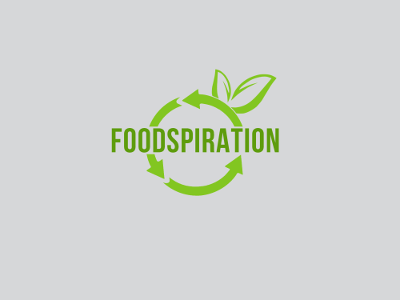
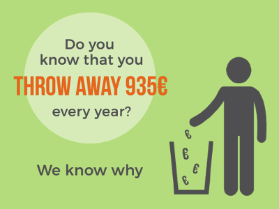
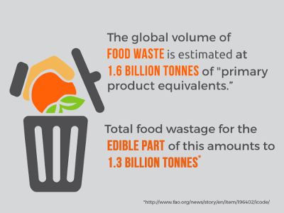
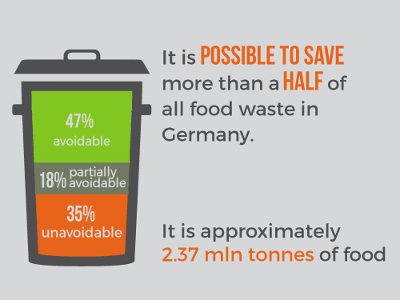
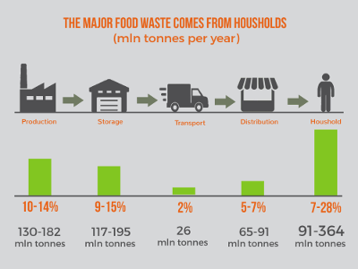
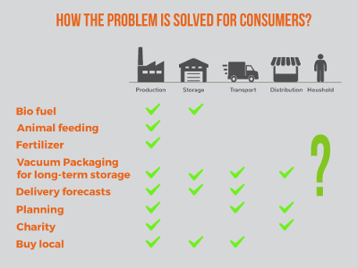

# Foodspiration - foodwaste reduction for all of us

### Problem description

In several statements we can define the project and the problem field as following. The foodwaste in rich and developed countries is significant to pay attention to. There are different parts of the food logistics where the optimization of business processes reduces an impact, but few other parts are always left behind. And those are most important for the whole food supply chain - end consumers. This project aims to explore our capability to use tech to reduce the foodwaste and give people more thoughtful way of consuming food products. The project is open for contrubutions.

### Idea definition

Build a shopping list mobile app similar to a todo-list. At some point a user should be able to see how much plastic he used as packaging for different types of food. For the "create item" function is important to have additional details about packaging and "use before" time. Possibly spoiled food thrown away should be tracked as well in a separately defined flow.

### Todo / features

 - draft a todo-like mobile app
 - feature: add item to the shopping list
 - feature: add description of an item at the time of shopping or after
 - feature: add a photo of an item
 - feature: add a "use before" date and time of an item
 - feature: add a status "spoiled" (?)
 - feature: checkmark an item (move from "to buy" to "bought")
 - feature: show statistics page with item names and amounts for given period of time (with filter)
 -

----

### Part of presentation

